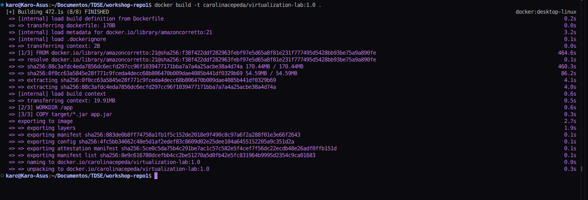
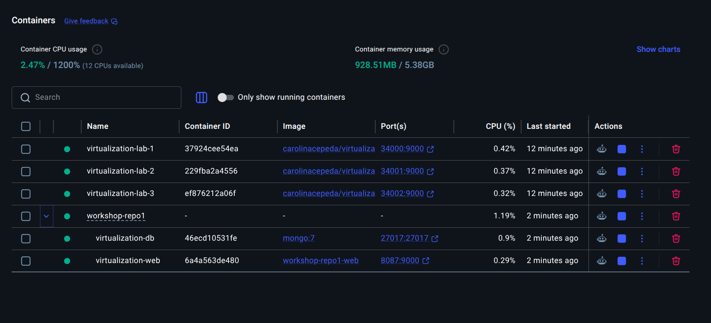
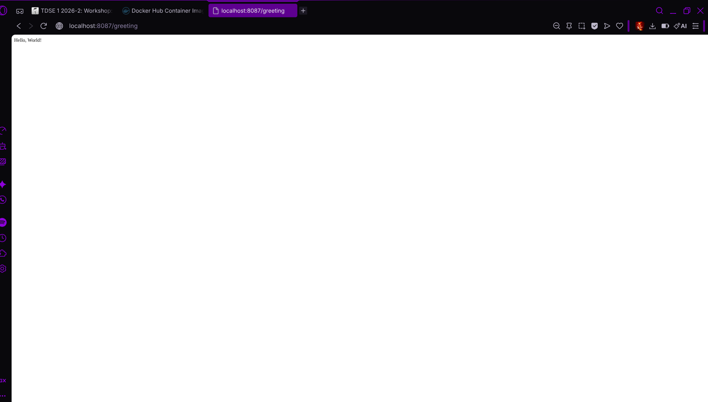
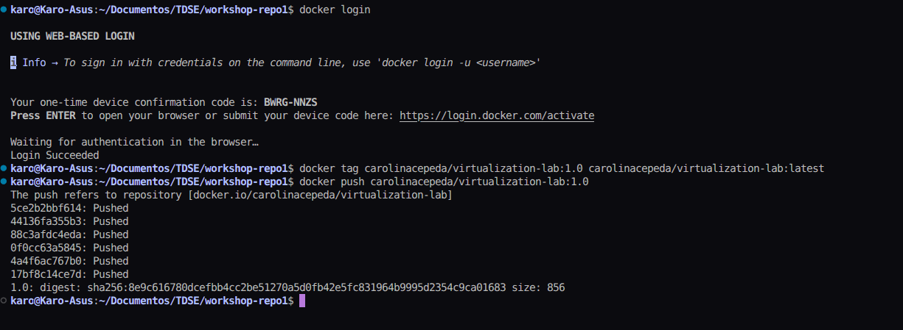
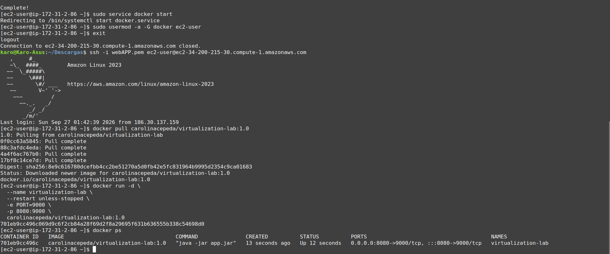
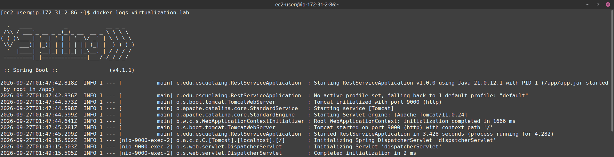
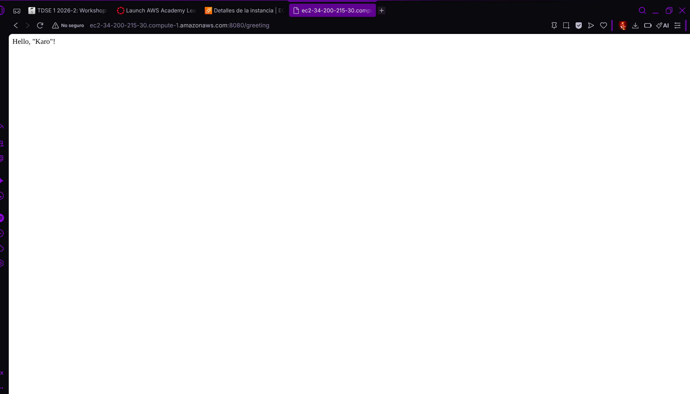

# Virtualization Lab: Containerizing and Deploying a Java Web Application


## Overview

This repository contains the implementation of the **Virtualization Workshop**: building a Spring Boot web application, containerizing it with Docker, orchestrating with Docker Compose (including MongoDB), publishing to Docker Hub, deploying to AWS EC2, and performing cost analysis.

---

## Table of Contents

- [Architecture](#architecture)
- [Technology Stack](#technology-stack)
- [Project Structure](#project-structure)
- [Part 1: Spring Boot Application](#part-1-spring-boot-application)
- [Part 2: Docker Image](#part-2-docker-image)
- [Part 3: Docker Compose](#part-3-docker-compose)
- [Part 4: Docker Hub](#part-4-docker-hub)
- [Part 5: AWS EC2 Deployment](#part-5-aws-ec2-deployment)
- [Part 6: Cost Analysis](#part-6-cost-analysis)
- [How to Run](#how-to-run)
- [Evidence](#evidence)

---

## Architecture

### Local Development (Docker Compose)

```
┌─────────────────────────────────────────────────────────────┐
│                        Docker Host                          │
│  ┌──────────────────┐         ┌──────────────────────────┐  │
│  │  Web Container   │         │      DB Container        │  │
│  │  (Spring Boot)   │◄───────►│      (MongoDB 7)         │  │
│  │  Port: 9000      │  db:27017│      Port: 27017         │  │
│  └────────┬─────────┘         └──────────────────────────┘  │
│           │                                                 │
│    ┌──────┴──────┐                                          │
│    │  Host Port  │                                          │
│    │    8087     │                                          │
│    └─────────────┘                                          │
└─────────────────────────────────────────────────────────────┘
```

### AWS EC2 Deployment

```
┌─────────────────────────────────────────────────────────────────────┐
│                           Client                                    │
│                              │                                      │
│                              ▼ HTTP                                 │
│  ┌─────────────────────────────────────────────────────────────┐   │
│  │                    AWS EC2 Instance                         │   │
│  │  ┌─────────────────────────────────────────────────────┐   │   │
│  │  │                 Security Group                      │   │   │
│  │  │  • SSH (22) - My IP only                            │   │   │
│  │  │  • HTTP (8080) - My IP only                         │   │   │
│  │  └─────────────────────────────────────────────────────┘   │   │
│  │                              │                              │   │
│  │                              ▼                              │   │
│  │  ┌─────────────────────────────────────────────────────┐   │   │
│  │  │                   Docker Engine                     │   │   │
│  │  │                              │                      │   │   │
│  │  │                              ▼                      │   │   │
│  │  │  ┌─────────────────────────────────────────────┐   │   │   │
│  │  │  │           Java Web App Container            │   │   │   │
│  │  │  │  • Port: 9000 (mapped to 8080)              │   │   │   │
│  │  │  │  • Image: carolinacepeda/virtualization-lab │   │   │   │
│  │  │  │  • Restart: unless-stopped                  │   │   │   │
│  │  │  └─────────────────────────────────────────────┘   │   │   │
│  │  └─────────────────────────────────────────────────────┘   │   │
│  └─────────────────────────────────────────────────────────────┘   │
└─────────────────────────────────────────────────────────────────────┘
```

---

## Technology Stack

| Component | Version |
|-----------|---------|
| Java | 21 LTS (Amazon Corretto) |
| Spring Boot | 4.1.1 |
| Maven | 3.9+ |
| Docker | 24.0+ |
| Docker Compose | v2 |
| MongoDB | 7.0 |
| Base Image | amazoncorretto:21 |
| AWS EC2 | Amazon Linux 2023 |

---

## Project Structure

```
workshop-repo1/
├── src/
│   └── main/
│       └── java/
│           └── co/edu/escuelaing/
│               ├── HelloRestController.java
│               └── RestServiceApplication.java
├── target/
│   └── virtualization-lab-1.0.0.jar
├── docs/
│   ├── aws_calculator.pdf
│   └── img/
│       ├── container_images_curl.png
│       ├── dockercompose_greeting.png
│       ├── docker_compose.png
│       ├── dockerhub_push.png
│       ├── dockerimage.png
│       ├── docker_images.png
│       ├── ec2_docker_container.png
│       ├── ec2_docker_logs.png
│       ├── ec2_external_test.png
│       └── mongo_dockercompose_test.png
├── Dockerfile
├── compose.yaml
├── pom.xml
├── .gitignore
└── README.md
```

---

## Part 1: Spring Boot Application

### REST Endpoint

**GET** `/greeting?name={name}`

```java
@RestController
public class HelloRestController {
    @GetMapping("/greeting")
    public String greeting(
            @RequestParam(value = "name", defaultValue = "World") String name) {
        return "Hello, " + name + "!";
    }
}
```

### Application Entry Point

The application reads its port from the `PORT` environment variable (default: **6000**):

```java
@SpringBootApplication
public class RestServiceApplication {
    public static void main(String[] args) {
        SpringApplication application = new SpringApplication(RestServiceApplication.class);
        application.setDefaultProperties(
                Map.of("server.port", System.getenv().getOrDefault("PORT", "6000")));
        application.run(args);
    }
}
```

### Build & Run Locally

```bash
mvn clean package
java -jar target/virtualization-lab-1.0.0.jar
```

**Test**: `http://localhost:6000/greeting?name=Karo` → `Hello, Karo!`

---

## Part 2: Docker Image

### Dockerfile

```dockerfile
FROM amazoncorretto:21
WORKDIR /app
COPY target/*.jar app.jar
ENV PORT=9000
EXPOSE 9000
ENTRYPOINT ["java", "-jar", "app.jar"]
```

### Build Image

```bash
docker build -t carolinacepeda/virtualization-lab:1.0 .
```

### Run Isolated Containers

```bash
# Container 1
docker run -d --name virtualization-lab-1 -e PORT=9000 -p 34000:9000 carolinacepeda/virtualization-lab:1.0

# Container 2
docker run -d --name virtualization-lab-2 -p 34001:9000 carolinacepeda/virtualization-lab:1.0

# Container 3
docker run -d --name virtualization-lab-3 -p 34002:9000 carolinacepeda/virtualization-lab:1.0
```

### Verify Isolation

| Container | Port | Test URL |
|-----------|------|----------|
| virtualization-lab-1 | 34000 | `http://localhost:34000/greeting?name=Container` |
| virtualization-lab-2 | 34001 | `http://localhost:34001/greeting?name=Container2` |
| virtualization-lab-3 | 34002 | `http://localhost:34002/greeting?name=Container3` |

Each container runs independently with its own filesystem, network stack, and process space.

---

## Part 3: Docker Compose

### compose.yaml

```yaml
services:
  web:
    build:
      context: .
      dockerfile: Dockerfile
    container_name: virtualization-web
    environment:
      PORT: 9000
      SPRING_DATA_MONGODB_URI: mongodb://db:27017/workshop
    ports:
      - "8087:9000"
    depends_on:
      - db

  db:
    image: mongo:7
    container_name: virtualization-db
    volumes:
      - mongodb:/data/db
      - mongodb_config:/data/configdb
    ports:
      - "27017:27017"
    command: mongod

volumes:
  mongodb:
  mongodb_config:
```

### Start Services

```bash
docker compose up -d --build
```

### Verify

```bash
docker compose ps
docker compose logs web
docker compose logs db
```

### Test Web Endpoint

```bash
curl http://localhost:8087/greeting?name=Compose
# Response: Hello, Compose!
```

### Test MongoDB Integration

```bash
# Insert document
docker exec virtualization-db mongosh workshop --eval "db.messages.insertOne({ message: 'Hello from Docker Compose' })"

# Query documents
docker exec virtualization-db mongosh workshop --eval "db.messages.find()"
```

**Output:**
```json
[
  {
    _id: ObjectId('...'),
    message: 'Hello from Docker Compose'
  }
]
```

### Data Persistence

Volumes `mongodb` and `mongodb_config` preserve data across container restarts:

```bash
docker compose down
docker compose up -d
# Data persists
docker exec virtualization-db mongosh workshop --eval "db.messages.find()"
```

### Cleanup

```bash
# Keep volumes (data preserved)
docker compose down

# Remove volumes (data deleted)
docker compose down -v
```

---

## Part 4: Docker Hub

### Login & Push

```bash
docker login

docker tag carolinacepeda/virtualization-lab:1.0 carolinacepeda/virtualization-lab:latest

docker push carolinacepeda/virtualization-lab:1.0
docker push carolinacepeda/virtualization-lab:latest
```

### Repository

**Docker Hub**: [carolinacepeda/virtualization-lab](https://hub.docker.com/r/carolinacepeda/virtualization-lab)

Tags available:
- `1.0` - Versioned release
- `latest` - Latest build

---

## Part 5: AWS EC2 Deployment

### Steps

1. **Create EC2 Instance**
   - AMI: Amazon Linux 2023
   - Type: t3.micro (Free Tier eligible)
   - Region: us-east-1 (N. Virginia)
   - Key Pair: Create/download `.pem` file
   - Security Group:
     - SSH (port 22) - All
     - Custom TCP (port 8080) : 0.0.0.0/0

2. **Install Docker on EC2**
   ```bash
   ssh -i your-key.pem ec2-user@<ec2-public-dns>
   
   sudo yum update -y
   sudo yum install -y docker
   sudo service docker start
   sudo usermod -a -G docker ec2-user
   
   # Log out and back in for group changes
   exit
   ssh -i your-key.pem ec2-user@<ec2-public-dns>
   ```

3. **Deploy Application**
   ```bash
   docker pull carolinacepeda/virtualization-lab:1.0
   
   docker run -d \
     --name virtualization-lab \
     --restart unless-stopped \
     -e PORT=9000 \
     -p 8080:9000 \
     carolinacepeda/virtualization-lab:1.0
   ```

4. **Verify Deployment**
   ```bash
   docker ps
   docker logs virtualization-lab
   ```
   
   **External test**: `http://<ec2-public-dns>:8080/greeting?name=Karo`
   Expected: `Hello, Karo!`

5. **Cleanup**
   - Terminate EC2 instance when workshop ends
   - AWS Console → EC2 → Instances → Terminate

---

## Part 6: Cost Analysis

### AWS Pricing Calculator Estimates

**Region**: US East (Ohio)

| Scenario | Requests/month | Instance Type | Monthly Cost |
|----------|---------------|---------------|--------------|
| Small Workload | 10,000 | t3.micro | $7.59 |
| Medium Workload | 100,000 | t3.small | $15.18 |
| Large Workload | 1,000,000 | t3.medium | $30.37 |

**Total Monthly (All Three)**: $53.14
**Total 12 Months**: $637.68

*Source: [AWS Pricing Calculator Export](docs/aws_calculator.pdf)*

### Detailed Cost Breakdown

| Scenario | Monthly Requests | Monthly Infra Cost | Cost per Request | Main Cost Drivers |
|----------|------------------|-------------------|------------------|-------------------|
| Small | 10,000 | $7.59 | $0.00076 | EC2 compute (fixed baseline) |
| Medium | 100,000 | $15.18 | $0.00015 | EC2 compute |
| Large | 1,000,000 | $30.37 | $0.00003 | EC2 compute, instance capacity |


### Architecture Discussion

**1. Why does EC2 have a baseline cost even with few requests?**

EC2 charges for allocated compute capacity (instance running), not per request.

**2. At what workload does fixed cost become negligible per request?**

At ~100,000 requests/month (Medium), cost/request drops to ~$0.00015. At 1M requests, it's ~$0.00003. The fixed cost amortizes over volume.

**3. What would force moving from one EC2 instance to multiple?**

Moving from one EC2 instance to multiple would be necessary if CPU or memory usage became saturated on the t3.micro instance (1 GB RAM, 2 vCPU), if high availability were required to eliminate the single point of failure, if traffic exceeded the instance's capacity, or if zero-downtime deployments were needed.

**4. Additional production services that would be needed in a real deployment, but are not part of the current implementation:**

- **Application Load Balancer (ALB)**: Distribute traffic and perform health checks (not yet implemented here)
- **Managed Database (RDS)**: MongoDB Atlas or DocumentDB instead of self-managed storage (not yet implemented here)
- **Monitoring (CloudWatch)**: Metrics, logs, and alarms (not yet implemented here)
- **Container Registry (ECR)**: Private image storage (not yet implemented here)
- **Backup/Disaster Recovery**: EBS snapshots and cross-region replication (not yet implemented here)
- **Auto Scaling Group**: Automatic capacity adjustment (not yet implemented here)
- **Certificate Manager (ACM)**: HTTPS/TLS termination (not yet implemented here)

**5. Would serverless be more cost-effective for small workload?**

Yes because AWS Lambda + API Gateway charges per request (~$0.20/million) + duration. For 10K requests: ~$0.002 vs $7.59 EC2. Serverless eliminates idle costs. Trade-off: cold starts, execution time limits, vendor lock-in.

---

## How to Run

### Prerequisites

- Java 21+
- Maven 3.9+
- Docker Desktop / Docker Engine + Compose v2
- Docker Hub account (for push)
- AWS Account (for EC2 deployment)

### Local Development

```bash
# Clone
git clone <this-repo>
cd workshop-repo1

# Build JAR
mvn clean package

# Run locally (JAR)
java -jar target/virtualization-lab-1.0.0.jar
# Test: http://localhost:6000/greeting?name=Karo
```

### Docker (Single Container)

```bash
# Build
docker build -t virtualization-lab:local .

# Run
docker run -d -p 6000:9000 -e PORT=9000 virtualization-lab:local
# Test: http://localhost:6000/greeting?name=Docker
```

### Docker Compose (Full Stack)

```bash
# Start all services
docker compose up -d --build

# Test web
curl http://localhost:8087/greeting?name=Compose

# Test MongoDB
docker exec virtualization-db mongosh workshop --eval "db.messages.find()"

# Stop (keep data)
docker compose down

# Stop (remove data)
docker compose down -v
```

### Use Published Image

```bash
docker pull carolinacepeda/virtualization-lab:1.0
docker run -d -p 8080:9000 -e PORT=9000 carolinacepeda/virtualization-lab:1.0
```

### AWS EC2 Deployment

```bash
# On EC2 instance 
docker pull carolinacepeda/virtualization-lab:1.0
docker run -d --name virtualization-lab --restart unless-stopped -e PORT=9000 -p 8080:9000 carolinacepeda/virtualization-lab:1.0

# Test externally
curl http://<ec2-public-dns>:8080/greeting?name=AWS
```

---

## Evidence

### Part 1: Local Spring Boot Execution

**Docker Image Build** - Shows the successful Maven build and JAR creation:



### Part 2: Docker Image & Isolated Containers

**Docker Images** - `docker images` output showing the built image:


**Container Curl Tests** - Three containers responding independently on ports 34000, 34001, and 34002:


### Part 3: Docker Compose

**Docker Compose Up** - `docker compose up -d --build` output showing both services starting:



**Compose Greeting** - Web endpoint responding on port 8087:



**MongoDB Test** - MongoDB insert/find verification showing data persistence:


### Part 4: Docker Hub

**Docker Hub Push** - Successful push of both `1.0` and `latest` tags to Docker Hub:



### Part 5: AWS EC2 Deployment

**EC2 Docker Container Running** - `docker ps` showing the container running on EC2:



**EC2 Docker Logs** - Application startup logs confirming successful deployment:



**EC2 External Test** - Browser test from local machine accessing the EC2 public endpoint:



### Part 6: Cost Analysis

**AWS Pricing Calculator Export** - Complete cost estimate for three workload scenarios:


*Or view the PDF directly: [aws_calculator.pdf](docs/aws_calculator.pdf)*